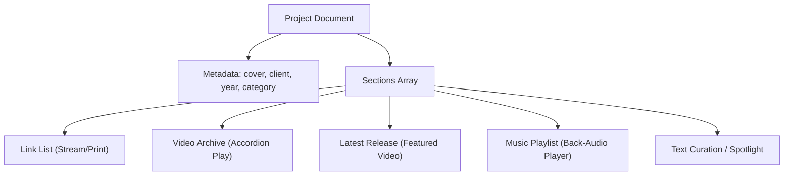

# ARTIC / Official Gallery & Webzine Boilerplate

이 리포지토리는 예술 갤러리 및 모던 에디토리얼 웹진 스타일의 초고화질 정적 웹사이트 보일러플레이트입니다. 
가벼운 로드 속도, 높은 디자인 완성도, SEO 강점을 가지며 빌드 엔진(Node.js/Python) 없이도 로컬 브라우저에서 즉시 개발 및 편집이 가능합니다.

---

## 📂 폴더 구조 및 아키텍처

프레임워크 없이도 모듈화된 관리가 가능하도록 구조적으로 설계되었습니다:

```
Homepage/
├── index.html            # 메인 HTML5 뼈대 (웹진의 에디토리얼 그리드 구조)
├── css/
│   ├── main.css          # 모든 CSS 모듈을 모아서 로드하는 진입점
│   ├── design-system.css # [중요] 디자인 토큰 (CSS 변수: 색상, 폰트, 여백 설정 및 자동 다크모드)
│   ├── base.css          # 기본 리셋 및 프리미엄 미니멀 스크롤바 디자인
│   ├── layout.css        # 비대칭 에디토리얼 그리드 및 컨테이너 레이아웃
│   ├── typography.css    # 럭셔리 세리프와 지오메트릭 산세리프 폰트 페어링
│   ├── animations.css    # cinematic 페이드 인, 스크롤 리빌, 마우스 오버 줌 트랜지션
│   └── components/
│       ├── navbar.css    # 반투명 글래스모피즘 플로팅 상단 메뉴
│       ├── gallery.css   # 웹진 카드 및 커스텀 CTA 버튼 스타일
│       └── footer.css    # 미니멀 에디토리얼 하단 영역
└── js/
    ├── app.js            # 상단 메뉴 스크롤 트리거 및 모바일 햄버거 토글 컨트롤러
    └── reveal.js         # Intersection Observer API 기반 고성능 스크롤 페이드 애니메이션
```

---

## 🎨 테마 및 스타일 커스터마이징 (디자인 토큰)

사이트의 전체적인 색상이나 서체, 애니메이션 느낌을 변경하고 싶다면, 개별 CSS를 뒤질 필요 없이 **`css/design-system.css`** 파일만 수정하면 됩니다:

```css
:root {
  /* 폰트 지정 */
  --font-serif: 'Cormorant Garamond', serif; /* 클래식 헤더 */
  --font-sans: 'Inter', sans-serif;         /* 가독성 높은 본문 */

  /* 라이트 모드 컬러 */
  --bg-primary: #FAF9F6;       /* 갤러리 웜 화이트 */
  --text-primary: #111111;     /* 딥 옵시디언 블랙 */
  --accent: #B89047;           /* 샴페인 골드 액센트 */
}

/* 시스템 다크모드 설정 (사용자 OS 설정에 따라 자동 변환) */
@media (prefers-color-scheme: dark) {
  :root {
    --bg-primary: #0A0A0A;     /* 벨벳 블랙 */
    --text-primary: #F3F3F3;   /* 리넨 화이트 */
    --accent: #D4AF37;         /* 클래식 골드 */
  }
}
```

---

## ✍️ 웹진 기사(아티클) 추가 방법

새로운 기사나 아트웍 카드를 메인 그리드에 추가하려면, `index.html` 내 `<div class="grid-editorial">` 태그 안에 아래의 에디토리얼 카드 마크업을 복사해서 붙여넣기만 하면 됩니다:

```html
<article class="art-card col-4 reveal">
  <div class="art-card-media zoom-frame">
    <!-- 이미지 태그()를 넣거나 플레이스홀더 SVG를 배치할 수 있습니다. -->
    
  </div>
  <div class="art-card-details">
    <span class="meta-tag">카테고리 / 이슈 번호</span>
    <a href="#" class="art-card-title"><h4>기사 제목 (세리프)</h4></a>
    <p>기사 본문에 대한 짧은 요약 또는 아티스틱 설명글입니다.</p>
    <span class="text-meta">작성일자</span>
  </div>
</article>
```
* **`.reveal`**: 화면 스크롤 시 아래에서 위로 부드럽게 페이드인되는 시네마틱 애니메이션이 자동으로 적용됩니다.

---

## 🚀 GitHub Pages 배포 가이드 (3분 완성)

이 보일러플레이트는 정적 HTML/CSS 기반이므로, 복잡한 빌드 워크플로우 없이 GitHub 상에서 클릭 몇 번으로 즉시 호스팅 배포가 가능합니다.

### 1단계: 코드를 GitHub 리포지토리에 푸시
현재 로컬에 작성된 뼈대 파일들을 리포지토리의 `main` 브랜치로 커밋 및 푸시합니다.
```bash
git add .
git commit -m "feat: setup premium art gallery and webzine boilerplate"
git push origin main
```

### 2단계: 리포지토리 Pages 설정
1. GitHub 리포지토리 페이지(`https://github.com/dev-artic/official_website`)로 이동합니다.
2. 우측 상단의 **Settings** 탭을 클릭합니다.
3. 좌측 사이드바의 **Code and automation** 아래에서 **Pages**를 선택합니다.
4. **Build and deployment** 섹션의 Source 옵션이 **Deploy from a branch**로 되어 있는지 확인합니다.
5. Branch 설정에서 **`main`** 브랜치와 **`/(root)`** 폴더를 지정한 뒤, 우측의 **Save** 버튼을 누릅니다.

### 3단계: 배포 확인
* 세팅을 완료하면 상단에 `Your site is live at...` 문구와 함께 호스팅 주소가 표시됩니다.
* 몇 초 후 **`https://dev-artic.github.io/official_website/`** 주소로 접속하면, 전 세계 어디서든 모던한 아트 갤러리 웹진 홈페이지를 확인하실 수 있습니다!


---

# 부록: 콘텐츠 관리 매뉴얼 & DB 스펙

# Database Structure Spec & Design Component Templatization

This specification outlines the unified data models, design templates, and interactive state rules for the artic. website. It defines the exact mapping between structured database entities and frontend UI/UX interactions to ensure high-fidelity consistency when creating new pages or adding content.

---

## 1. Core Architecture Data Model

### 1.1 Homepage Entity (`homepage`)
The main gateway coordinates site-wide sub-page navigation and features the premium interactive horizontal project showcase.
* **Fields**:
  * `navigator_links` (`Link[]`): List of navigation links (About, Projects, Contact).
  * `featured_projects` (`ProjectMeta[]`): List of projects showcased on the main slide.
* **UX Interaction Rules**:
  * **Logo Animating**: The central logo splits on load, followed by a simultaneous 1.8s delayed reveal of the navigation bar and the `discover` button.
  * **Discover Button Alignment**: Statically locked at `top: calc(50% + 100px)` (exactly 64px below the centered logo) on all screen heights.
  * **Selected Projects Slide**: Left-aligned scroll track using native hardware-accelerated CSS snaps (`scroll-snap-type: x mandatory` and `-webkit-overflow-scrolling: touch`) on mobile touch devices. Desktop supports mouse drag.

### 1.2 Project Metadata Schema (`Project`)
Each project record represents a distinct archive smartlink page. It contains core metadata and an array of nested dynamic content sections.
* **Fields**:
  * `id` (`string`): Unique slug ID (e.g., `tasting-note`).
  * `title` (`string`): Official project name.
  * `artist` (`string`): Artist or creator name.
  * `client` (`string`): Branding client. Defaults to `"artic."` if it is an original series.
  * `category` (`string`): Project category (e.g., `ORIGINAL SERIES`, `PRODUCTION`, `MUSIC CURATION`, `LP`).
  * `year` (`integer`): Release or archive year.
  * `release_date` (`string`): Format `YYYY.MM.DD` or `YYYY.MM` for timeline tracking.
  * `cover_image` (`string`): Path relative to resources.
  * `sections` (`Section[]`): Ordered array of section components.

---

## 2. Project Page Section Templatization

Every project detail page utilizes a standard two-column content grid (`.content-columns`) on desktop that collapses into a single-column stack on mobile. Sections are categorized by content type (`type`), each dictating a specific layout and interaction flow.



---

## 3. Section Types & Interaction Matrix

### 3.1 Link List (`link_list`)
A collection of external platform links or document downloads.
* **Use Cases**: `Stream` (Spotify/Apple Music links), `Print` (Lyrics PDF/Interviews).
* **HTML Component Template**:
  ```html
  <main class="links-container expanded">
    <div class="mobile-toggle-header">
      <span class="archive-group-label stream-label">Stream</span>
      <span class="toggle-icon"></span>
    </div>
    <div class="toggle-content">
      <a href="{url}" target="_blank" class="link-item">
        <div class="platform-info">
          <div class="platform-logo">{svg}</div>
          <span class="platform-name">{platform}</span>
        </div>
        <span class="listen-badge">{badge_text}</span>
      </a>
    </div>
  </main>
  ```
* **Interactivity Rules**:
  - **Desktop**: Renders as a clean, static side column (typically Left).
  - **Mobile**: Becomes an accordion container that loads `.expanded` by default. Toggles collapsing/expanding when clicking the `.mobile-toggle-header`.

---

### 3.2 Video Archive (`video_archive`)
An interactive playlist of archive visualizers, documentaries, or listening sessions.
* **Use Cases**: `Film`, `Episodes`.
* **HTML Component Template**:
  ```html
  <div class="archive-group expanded">
    <div class="mobile-toggle-header">
      <span class="archive-group-label film-label">Film</span>
      <span class="toggle-icon"></span>
    </div>
    <div class="archive-list toggle-content">
      <div class="archive-entry" data-vid="{youtube_id}">
        <a class="archive-item" href="javascript:void(0)">
          <div class="archive-item-left">
            <svg class="archive-icon">{svg}</svg>
            <div>
              <span class="archive-item-type">{sub_type}</span>
              <span class="archive-item-title">{title}</span>
            </div>
          </div>
        </a>
        <div class="archive-embed"></div>
      </div>
    </div>
  </div>
  ```
* **Interactivity Rules**:
  - **Iframe Embedding (Accordion Play)**: Clicking an `.archive-item` swaps out the empty `.archive-embed` with a responsive YouTube iframe player.
  - **Exclusive Playback**: Only one video inside the archive list can play at a time. Activating a video pauses/closes any other playing embed in the grid.
  - **Desktop Grid**: Renders as a 2-column list.
  - **Mobile Accordion**: Header toggle collapses/expands the entire group list smoothly.

---

### 3.3 Latest Release (`latest_release_video`)
A featured, highly visible single video section with full credit lists and text briefs.
* **Use Cases**: `Latest Release` on Tasting Note or Neutral Interview.
* **HTML Component Template**:
  ```html
  <main class="links-container expanded">
    <div class="mobile-toggle-header">
      <span class="archive-group-label stream-label">Latest Release</span>
      <span class="toggle-icon"></span>
    </div>
    <div class="toggle-content">
      <div class="static-content">
        <div class="archive-entry active" data-vid="{youtube_id}">
          <!-- Featured Header Item -->
          <div class="archive-embed open">
            <div class="custom-video-poster" data-vid="{youtube_id}">
              
              <div class="poster-play-btn">{play_svg}</div>
            </div>
          </div>
        </div>
      </div>
      <!-- Follow-up Credits/Brief -->
      <div class="project-brief">{brief_html}</div>
      <div class="project-starring">{starring_html}</div>
    </div>
  </main>
  ```
* **Interactivity Rules**:
  - **Default State**: Initialized as `.expanded` and `.open`. The video poster loads immediately.
  - **Play Trigger**: Clicking the video poster replaces it dynamically with a YouTube Iframe player that autoplay-triggers.
  - **Desktop Layout**: Locked in the Left Column.
  - **Mobile Layout**: Positions itself at the absolute top of the page below the cover art.

---

### 3.4 Music Playlist (`music_playlist`)
An inline audio player playlist integrated with a background player engine.
* **Use Cases**: Gagosian Party Playlist.
* **HTML Component Template**:
  ```html
  <div class="info-group expanded">
    <div class="mobile-toggle-header">
      <span class="info-group-label playlist-label">Playlist</span>
      <span class="toggle-icon"></span>
    </div>
    <div class="info-content toggle-content">
      <div class="archive-list">
        <div class="archive-entry" data-vid="{youtube_audio_id}">
          <a class="archive-item" href="javascript:void(0)">
            <div class="archive-item-left">
              <svg class="archive-icon">{play_pause_svg}</svg>
              <div class="archive-item-text">
                <span class="archive-item-type">{artist}</span>
                <span class="archive-item-title">{title}</span>
              </div>
            </div>
          </a>
        </div>
      </div>
    </div>
  </div>
  ```
* **Interactivity Rules**:
  - **Hidden API Engine**: Spawns an off-screen `1x1` pixel YouTube player iframe inside a hidden container on first page interaction.
  - **Inline Playlist Toggles**: Track items render `.playing` or `.paused` active states. Clicking an active playing track paused it. SVGs toggle dynamically between triangle and pause bars.
  - **Volume Fading Cross-Fades**:
    - Pausing fades audio volume from 100 to 0 over 600ms before pausing.
    - Play/Resume starts at 0 volume and fades up to 100 over 600ms.
    - Track Switching fades out the active track (400ms), stops, loads the new track, and fades in (600ms).

---

### 3.5 Text Curation (`text_curation`)
Multi-lingual (typically Korean and English) narrative description columns.
* **Use Cases**: `Artist Spotlight`, `Music Curation`.
* **HTML Component Template**:
  ```html
  <div class="info-group expanded">
    <div class="mobile-toggle-header">
      <span class="info-group-label artist-label">Spotlight</span>
      <span class="toggle-icon"></span>
    </div>
    <div class="info-content toggle-content">
      <h2 class="info-title">{title}</h2>
      <div class="info-subtitle">{subtitle}</div>
      <div class="info-desc">
        <p>{body_ko}</p>
        <p class="en-translation">{body_en}</p>
        <!-- Optional Key-Value Metadata Grid -->
        <div class="info-meta-list">
          <div class="info-meta-item">
            <span class="info-meta-key">{key}</span>
            <span>{value}</span>
          </div>
        </div>
      </div>
    </div>
  </div>
  ```

---

## 4. Responsive Device Layout Rules

| Screen Viewport | Grid Structure | Collapsibility | Alignment / Gutters | Cover Art Sizing |
| :--- | :--- | :--- | :--- | :--- |
| **Desktop (>=768px)** | 2-Column Row (`.content-columns`) | Stays expanded (Static Grid) | `padding-left: var(--gutter)` (40-80px aligned) | Shrinks from `280px` to `170px` on Phase 3 animation |
| **Mobile (<768px)** | 1-Column Vertical Stack | Collapsable via `.mobile-toggle-header` | `padding-left: var(--gutter)` (24px gutter snap) | Shrinks from `280px` to `170px` centering dynamically |

---

## 5. Firebase 백엔드 및 주문 관리 시스템

이 리포지토리는 프론트엔드 정적 호스팅(GitHub Pages)과 독립된 서버리스 백엔드(Firebase Cloud Functions & Firestore) 하이브리드 아키텍처를 사용합니다.

### 5.1 아키텍처 흐름
1. **결제/구독 요청 (Client)**: 
   - `deus-ex-machina` 등의 프로젝트 상세 페이지에 임베드된 결제 폼에서 필수 입력값 검증 후 POST 요청을 보냅니다.
   - API Endpoint: `https://us-central1-artic-official-home.cloudfunctions.net/checkout`
2. **주문 처리 (Firebase Cloud Functions)**:
   - 요청 데이터를 파싱하여 유효성 및 필드 검증을 거칩니다.
   - 주문 내역 데이터를 Firestore 데이터베이스(`orders` 컬렉션)에 고유 ID 문서로 저장합니다.
   - Nodemailer 및 Daum 스마트워크 SMTP 서비스(`smtp.daum.net:465`)를 통해 고객과 관리자(`admin@artic.live`)에게 자동 이메일 안내장을 발송합니다.
3. **결제 대기 및 처리 (Noreply / Manual)**:
   - 고객에게는 토스뱅크 계좌번호와 수량별 합계 금액(상품가 15,000원 * 수량 + 배송비 3,000원) 및 입금 요청 정보가 메일로 전달됩니다.
   - 관리자는 메일 알림 수신 후, 실시간으로 입금 여부를 수동 매칭하여 상품을 배송합니다.

### 5.2 Firestore 데이터베이스 스펙 (`orders` 컬렉션)
각 주문 레코드는 다음과 같은 구조로 기록됩니다:
* `name` (string): 주문자/신청자 이름
* `email` (string): 이메일 주소 (안내 이메일 수신용)
* `phone` (string): 연락처 (배송 안내용)
* `address` (string): 배송지 주소
* `quantity` (number): 주문 상품 수량 (개당 15,000원)
* `depositor` (string): 입금자명 (주문자와 다를 경우 지정, 기본값은 `name`)
* `notes` (string): 추가 요청사항/메모
* `created_at` (server timestamp): Firestore 서버 타임스탬프 기준으로 기록된 주문 생성 일시

### 5.3 백엔드 개발 및 로컬 테스트 환경
백엔드 로컬 테스트 및 관리를 위해 Firebase CLI 환경을 지원합니다:
1. **의존성 설치**:
   ```bash
   cd functions
   npm install
   ```
2. **로컬 에뮬레이터 실행**:
   `functions` 디렉토리 혹은 루트에서 Firebase Local Emulator Suite를 실행하여 백엔드 트리거 및 Firestore 로컬 동작을 모의 테스트할 수 있습니다.
   ```bash
   npx firebase emulators:start
   ```
3. **환경 변수 구성 (.env)**:
   `functions/.env` 파일에 SMTP 인증 자격증명을 설정해야 메일 발송이 정상 동작합니다.
   ```env
   SMTP_HOST=smtp.daum.net
   SMTP_PORT=465
   SMTP_USER=admin@artic.live
   SMTP_PASSWORD=your_app_password
   ADMIN_EMAIL=admin@artic.live
   ```

### 5.4 백엔드 배포 가이드
수정된 Functions 백엔드 코드는 Firebase CLI를 통해 즉시 배포할 수 있습니다:
```bash
npx firebase deploy --only functions
```

---

## 부록: 프로젝트 추가 방법 (단일 데이터 소스 구조)

### 개요

모든 프로젝트 메타데이터는 **/projects.json** 하나의 파일로 관리됩니다.  
이 파일을 수정하면 **첫 화면 프리뷰 섹션**과 **프로젝트 아카이브 페이지**가 동시에 자동 반영됩니다.

```
projects.json - 단일 원본 소스
    ├── fetch() -> index.html (첫 화면 preview 카드)
    └── fetch() -> projects/index.html (연도별 슬라이드 뷰)
```

### 신규 프로젝트 추가 절차

#### Step 1. 프로젝트 폴더 생성

```
Homepage/
└── {slug}/           (예: my-new-project)
    ├── index.html    - 프로젝트 상세 페이지
    └── album-art.png - 커버 이미지 (4:5 비율 권장)
```

#### Step 2. projects.json 항목 추가

파일 상단에 객체를 **prepend** (최신순 유지):

```json
[
  {
    "id": "{slug}",
    "title": "프로젝트 타이틀",
    "client": "클라이언트명 또는 artic.",
    "category": "ORIGINAL SERIES | PRODUCTION | MUSIC CURATION | LP | ORIGINAL CONTENTS",
    "year": 2026,
    "cover_image": "../{slug}/album-art.png",
    "slug": "/{slug}/"
  },
  ...기존 항목들...
]
```

> **cover_image 경로 규칙**: projects.json은 사이트 루트(/)에서 서빙되므로  
> 이미지 경로는 ../ 접두사 사용 (예: ../the-root/album-art.png).  
> 첫 화면 렌더링 시 JS가 ../를 루트 경로로 자동 변환합니다.

#### Step 3. index.html 상세 페이지 작성

프로젝트 성격에 따라 기존 템플릿 중 하나를 복사하여 사용:

| 템플릿 | 참고 파일 | 사용 시나리오 |
|--------|-----------|--------------|
| 비디오 아카이브 시리즈 | the-root/index.html | 다큐/인터뷰 에피소드 시리즈 |
| 스트리밍 링크 + 영상 | deus-ex-machina/index.html | LP/음반 |
| 큐레이션 + 플레이리스트 | gagosian-party-music/index.html | 이벤트 큐레이션 |
| 에피소드 + 텍스트 비평 | tasting-note/index.html | 오리지널 시리즈 |

#### Step 4. Push

```bash
git add projects.json {slug}/ 
git commit -m "feat: add {project title}"
git push origin main
```

GitHub Pages가 자동 빌드/배포합니다. 첫 화면 + 프로젝트 페이지 동시 반영.

---

### YouTube 플레이리스트 자동 갱신 (Project : The Root 전용)

`scripts/update_the_root.py` + `.github/workflows/update-the-root.yml`로 주 1회 자동 실행됩니다.

| 설정 항목 | 값 |
|----------|-----|
| 자동 실행 주기 | 매주 화요일 KST 오전 9시 |
| 수동 실행 | GitHub -> Actions -> "Update The Root Playlist" -> Run workflow |
| 필요 Secret | YOUTUBE_API_KEY (Settings -> Secrets -> Actions) |
